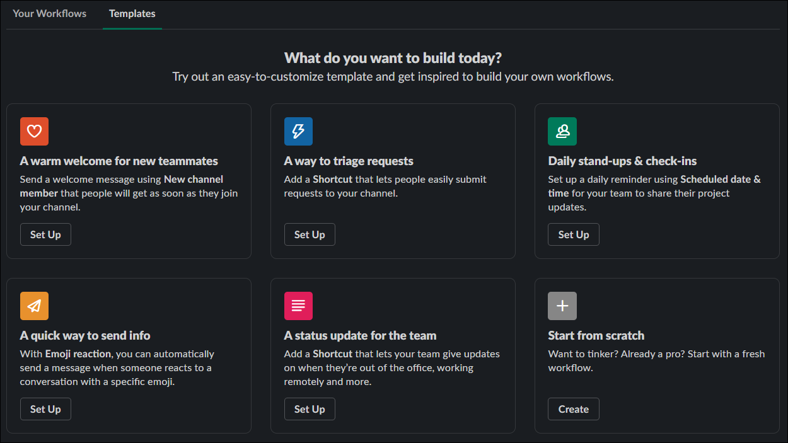
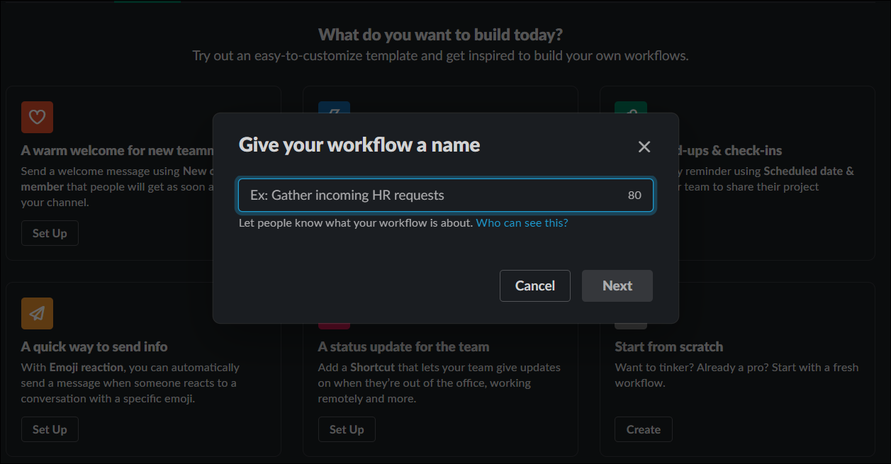
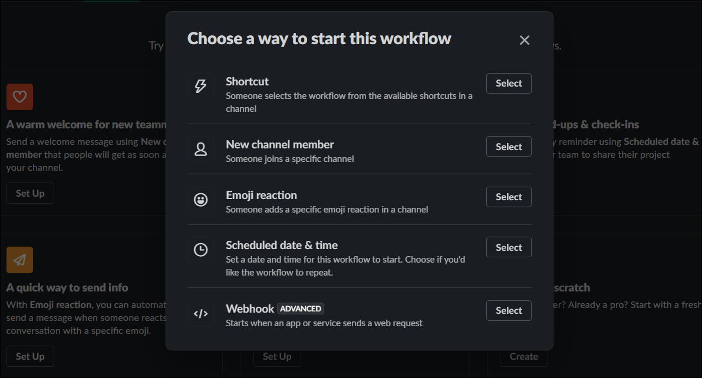
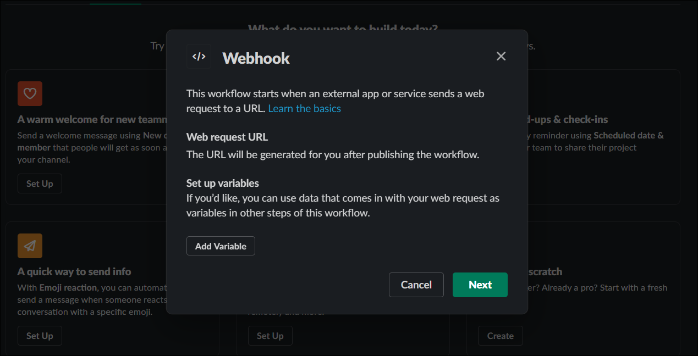
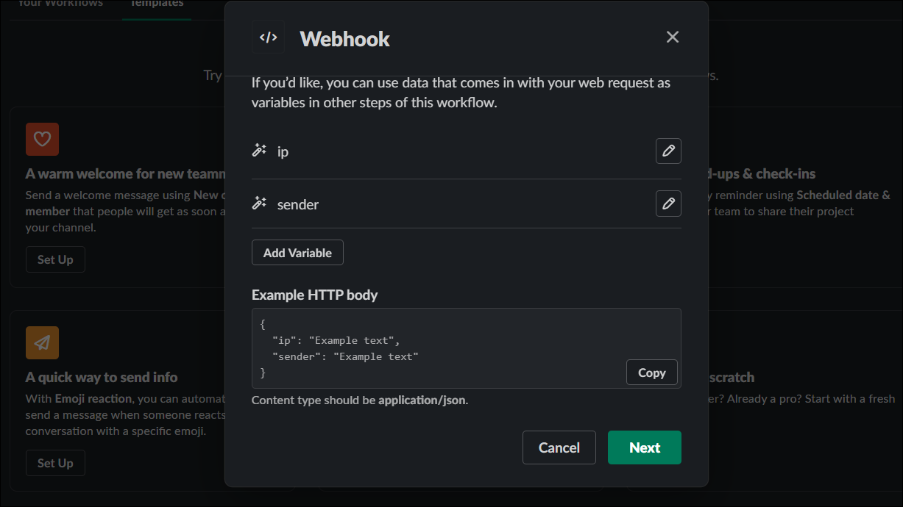
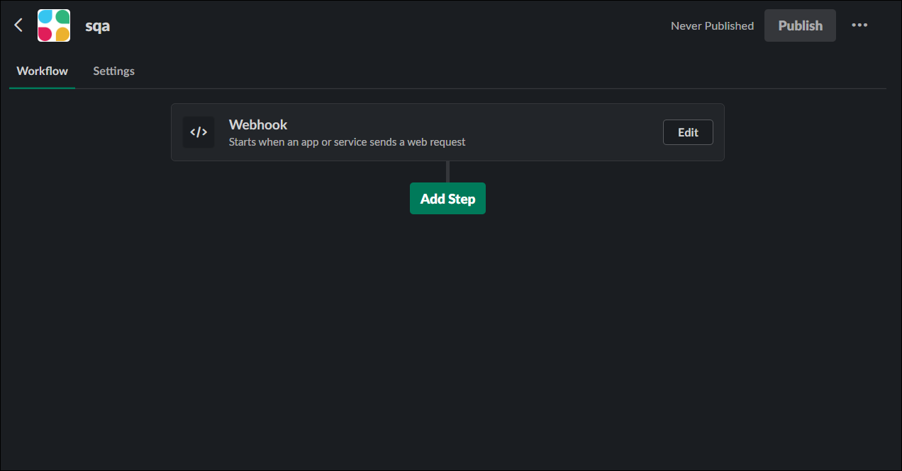
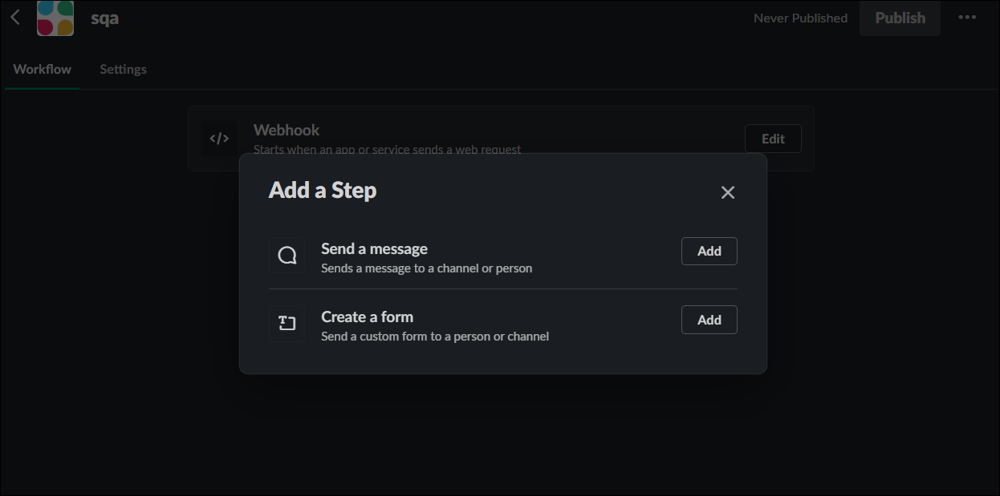
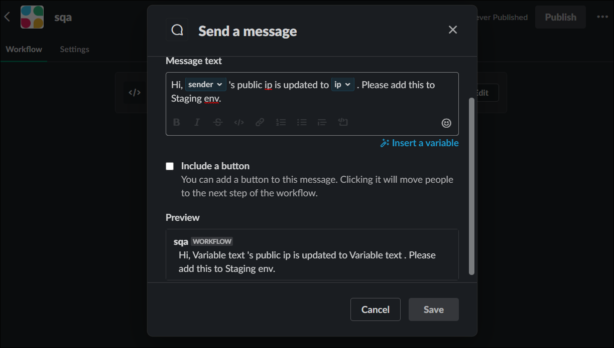
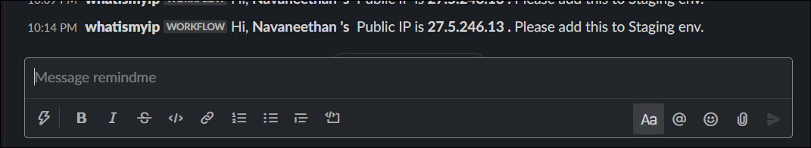

* https://ident.me fails to get ipv4 address from my mobile network jio.
Only ipv6 is returned. So switched to https://ipinfo.io/ip.

Create a workflow with Slack's Workflow builder

* Login to your paid slack account. 
* Workflow is not available in free account.
* Click the flash icon present in your DM.
* You will be displayed with this.

* Select "Start from Scratch". 
* Provide a name for your Workflow.

* Choose "Webhook" in "Choose a way to start this workflow" page.

 * You can add variables to receive the values sent to the slack.
 
 
 * This is what I did for my case.
 
 
 * Click Next.
 
 
 * Add another step to the workflow like "send a message" or "create a form"
 
 
 * Customise the message and include the variables you created and choose a channel to send this message to.
 
 
 * The output will be like this
 
 